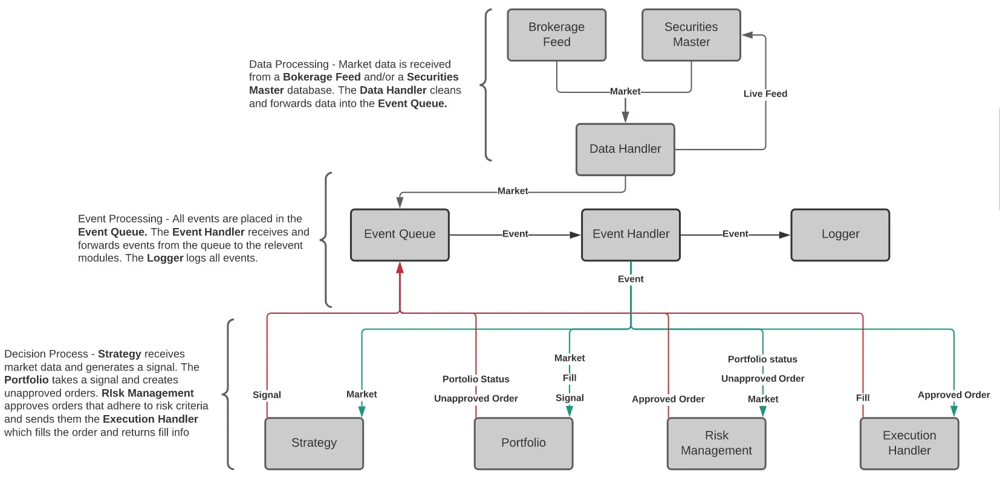
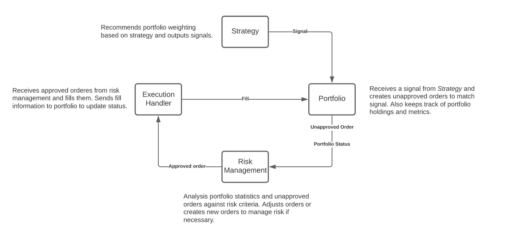

# Back Tester

_Pet-project for quant trading self-training_

Trying to study [Nautilus Trader](https://github.com/nautechsystems/nautilus_trader), and create my own version of event-driven back testing system via Python, and gradually imporve it's performance.

Using:

- [x] [Polars](https://www.pola.rs/) as data handller
- [ ] [Redis](https://redis.io/) as historical data & cache storage

Main Idea is from 

AND

## Data Handling
Needed functionalities:

- [ ] Aggregation: Convert data into different timeframes

