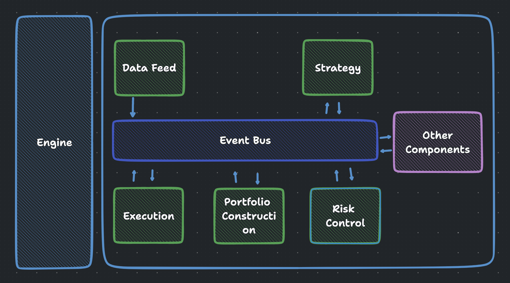

# Back Tester

## Status

This is a personal project and it's currently under development as part of my self-study efforts. The project is continually evolving as I learn and incorporate more features and improvements. Feel free to explore, learn from it, or provide suggestions!

---

The project has been paused as I have shifted my focus into C++ now. I might re-implement this via C++.

## About

Pet-project for quant trading self-training. 

## Key Features

- **Event-Driven Architecture**: The backtester operates on an event-driven system that accurately simulates the order of market events, providing a strong foundation for concurrent processing.
- **Asynchronous Programming**: The backtester uses asyncio for writing single-threaded concurrent code, which allows for efficient multiplexing of I/O access over various resources.
- **Data Handling with Polars**: Leveraging the power of Polars, a lightning-fast DataFrame library implemented in Rust, for efficient and effective data handling.
- **Flexible and Powerful**: The backtester is designed to be adaptable, allowing for the testing of a wide variety of trading strategies, from simple moving average cross-overs to complex machine learning-based approaches.

## Main Components

- **Data Feed**: The data feed component is responsible for providing the backtester with market data. This can be historical data for backtesting purposes or live data for paper trading.
- **Strategy**: This component is where you define your trading strategy. It processes market data and generates trading signals.
- **Execution Handler**: The execution handler simulates order execution. It takes trading signals from the strategy component and simulates the execution of the corresponding orders.
- **Performance Tracking**: The backtester includes functionality for tracking the performance of a strategy over the course of a backtest. This includes calculating various performance metrics and generating performance charts.
- **Risk Management** : involving setting limits on the total exposure to any one asset, ensuring that the portfolio is sufficiently diversified, rebalancing the portfolio periodically, etc.

## Future Development

- [x] [Polars](https://www.pola.rs/) as data handller
- [ ] [Redis](https://redis.io/) as historical data & store frequently used data (e.g. like the latest prices or indicators calculated over a rolling window)
- [ ] Restful API to fetch real-time or historical data from an external source

## Strucutre

## Inspiration

This project was inspired by [FunCoder](https://github.com/wangzhe3224). I'm grateful for the ideas and knowledge gained from his work which served as a foundation.

## Disclaimer
Please note that this project is primarily for my personal learning and exploration. As such, it may not be regularly maintained or updated. I welcome any constructive feedback or suggestions for improvement!
